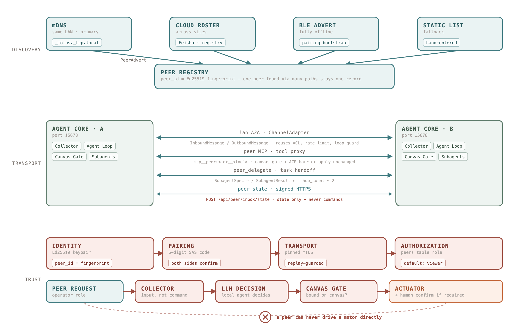

# Phanthy Motus

[中文文档](README_zh.md) | [Official Website](https://motus.phanthy.com)

**Give Embodied AI a Real Soul.** PhanthyMotus is a next-generation, open-source framework and platform for Embodied AI Agents. Built upon a robust ROS2 foundation, it seamlessly bridges diverse sensor inputs with advanced robot execution. By enabling flexible integration of World Models, LLMs, and VLMs, PhanthyMotus transforms traditional hardware into soulful, intelligent assistants capable of perceiving, thinking, and acting independently in the real world.

## Quick Start

Install and run with a single command:

```bash
curl -fsSL https://motus.phanthy.com/install.sh | sudo bash
```

Or specify a version:

```bash
curl -fsSL https://motus.phanthy.com/install.sh | sudo bash -s <tag>
```

The install script will automatically install Docker (if needed), pull the latest Agent Core image, and start the service.

Open `http://<device-ip>:15678` to access the Web Dashboard.

Browse available versions and images at the [Resource Center](https://motus.phanthy.com).

### Connect Hardware

Deploy hardware drivers from **[phanthymotus-driver](https://github.com/4paradigm/phanthymotus-driver)**. Drivers automatically register with Agent Core on startup — no manual configuration needed.

### Build from Source

See [CONTRIBUTING.md](CONTRIBUTING.md) for building and running from source code.

## Features

- **Visual Orchestration** — Drag-and-drop web dashboard for connecting devices, sensors, and AI models on a canvas
- **MCP Data Bus** — Unified [Model Context Protocol](https://modelcontextprotocol.io) interface for all hardware devices
- **Driver-Inferred Topics** — Output ROS2 topics are declared by drivers, not computed by the core. The canvas calls each driver's `info` action (passing `instance_id` for sensors or `input_topic` for processors) to get the exact topic path before the device starts, keeping all topic naming logic inside the driver
- **Event-Driven Agent Loop** — LLM-powered reasoning with multi-turn tool calling, driven by real-time sensor events
- **ROS2 Integration** — Native DDS bridge for seamless ROS2 topic relay and monitoring
- **Pluggable Perception** — Modular ASR/TTS stack with multi-instance support and local inference (Jetson)
- **Web Dashboard** — Real-time device monitoring, agent activity stream, and configuration — all from the browser

## Architecture


> Editable source: [`docs/architecture.svg`](docs/architecture.svg) — re-export the PNG after changing it.

The platform runs a single **sense → think → act** loop:

`Hardware → Driver·Sensor → Perception → Agent Loop → ActuCore → Driver·Actuator → Hardware`

- **Drivers (L1)** — One MCP server per device. Every tool declares a `type`, and the Agent Core treats each type differently: `sensor` (data streams), `actuator` (executable actions), `processor` (data transforms), `resource` (static assets such as URDF). Sensor and actuator tools normally live in the **same** driver process — the diagram splits them by direction of data flow, not by deployment.
- **Perception (L2, ports 15720 / 15721)** — Turns raw streams into semantics: ASR, TTS, VLM captions, vision understanding, face recognition.
- **ActuCore (L2, port 15730)** — The execution-model side of the same layer, shipped in this repository as [`actucore/`](actucore/): VLA policies, navigation, grasping, locomotion, whole-body control. It is a card host, structurally identical to Perception — each execution model attaches as a `processor` card, so any model that takes a goal and emits motion commands plugs in the same way. **It currently ships no cards**; the models are chosen per robot. See [`actucore/README.md`](actucore/README.md) for the card contract.
- **Agent Loop (L3, port 15678)** — FastAPI + `ros2_bridge.py`: event collector, layered L1–L4 prompt, tool dispatch, ACP barrier, history compaction, steering / interrupt, task store, subagent manager, skills, memory.
- **Two bypass lanes** — The loop can call `sensor` tools directly, skipping perception; and it can drive `actuator` tools over MCP JSON-RPC directly, skipping ActuCore. Both are the common path for simple queries and one-shot commands.
- **Web Dashboard** — Subscribes to every DDS topic on the bus via `/ws/bus/{topic}`, and to the agent's decision stream via `/ws/motus`.

Hardware drivers are maintained in a separate repository: **[phanthymotus-driver](https://github.com/4paradigm/phanthymotus-driver)**.

### Multi-Agent Peers

> **Status: partly implemented.** Measured on two Orin test rigs, per granularity:
>
> | Piece | State |
> |---|---|
> | mDNS discovery, SAS pairing | works — both rigs paired, `operator` role |
> | State sharing (signed HTTPS) | works — each side holds the other's topic list, refreshed every 5s |
> | Tool proxy, **inbound** (serving a peer) | works — a signed `tools/list` returns exactly the tools bound on the receiver's canvas |
> | Tool proxy, **outbound** (calling a peer's tools) | **not implemented** — nothing registers a peer as a synthetic MCP entry, so the local LLM cannot see or call them |
> | Messaging (`lan` ChannelAdapter) | code exists, **not exercised** — no `lan` channel was configured on either rig |
> | Task delegation (`peer_delegate`) | code and hop-count limit exist, **not exercised across machines** |
> | Cloud roster discovery | stub |
> | More than two peers | never tried |
>
> Feishu bot-to-bot (`bot_to_bot_enabled` + `trusted_bots`, see
> [Feishu channel setup](docs/feishu-channel-setup.md)) remains the internet-dependent path.



> Editable source: [`docs/peer-mesh.svg`](docs/peer-mesh.svg) — re-export the PNG after changing it.

Robots collaborate as **peers**: each side runs its own Agent Core and keeps its own autonomy.
Discovery, transport and trust are three independent, pluggable layers, so a peer can be found
over mDNS and talked to over mTLS, or found via a cloud roster and talked to over Feishu.

**Discovery** — providers all emit the same `PeerAdvert`, keyed by `peer_id` (an Ed25519 public-key
fingerprint, *not* an IP or platform account). One peer discovered over several paths therefore
stays one record with several links, which is what makes fallback possible.

| Provider | Needs | Used for |
|---|---|---|
| mDNS / DNS-SD (`_motus._tcp.local`) | Same LAN | Same site — the primary path |
| ~~DDS presence (`/motus/presence`)~~ | — | **Not usable.** DDS is now pinned to loopback (see below), so nothing DDS-based crosses machines |
| Cloud roster | Internet | Across sites and subnets |
| BLE advert | A Bluetooth radio, unblocked | **Discovery** where there is no shared IP network. Carries the key, not a data plane — the pairing handshake that follows still needs IP reachability |
| Static list | Nothing | Fallback, always kept |

**Transport — four granularities of collaboration:**

1. **Messages** — a `lan` `ChannelAdapter`, so peer conversations reuse the existing channel stack
   unchanged: `InboundMessage`/`OutboundMessage`, ACL roles, rate limiting, `expect_reply` loop
   guard, and collector batching by trust level. Feishu and LAN are then two links with identical
   agent-side semantics, which gives "internet when available, LAN when not" for free.
2. **Tools** — the receiving half is built: `/api/peer/tools/list` and `/api/peer/tools/call`
   authenticate the caller, then apply its role, its `tool_filter`, **and the receiver's own canvas
   gate**, so a peer can only reach what a human wired locally. The sending half — registering a
   peer as a synthetic MCP entry (`transport: 'peer'`) so its tools appear to the local LLM as
   `mcp__peer:<id>__<tool>` — is **not implemented yet**; it needs a decision on whether peer tools
   are exposed through the canvas (no UI for a peer card today) or exempted from it.
3. **State** — topic lists and, later, pose/battery/task state, pushed over the same signed HTTPS
   link (`POST /api/peer/inbox/state`). This used to be DDS topics; DDS is now confined to the
   local host, and a FastDDS *default* profile applies to every participant in the process, so the
   loopback restriction cannot be lifted for peer traffic alone by configuration. (Per-participant
   profiles are possible by setting `FASTRTPS_DEFAULT_PROFILES_FILE` around each participant's
   creation — the Tianyi driver's bridge does exactly that for its two domains — but that requires
   owning every creation site, which is not the case across agent-core, perception, actucore and a
   dozen drivers. Signed HTTPS is also the better answer on its own terms: it authenticates.) The move fixed a real hole on the way: the DDS peer bus
   had **no authentication**, so anything on the same `ROS_DOMAIN_ID` could forge another robot's
   state. It still carries state only, never commands.
4. **Tasks** — `peer_delegate` ships a `SubagentSpec` to a peer, which spawns a subagent locally and
   returns a `SubagentResult`. The receiver re-clips `tool_filter` against the peer's own role — the
   sender's list is a request, not a grant — and `hop_count > 2` is refused so delegation chains
   cannot storm.

**Trust** — every Agent Core generates an Ed25519 identity key on first boot; `ACCESS_TOKEN` narrows
to "a human operating this dashboard" and is no longer the cross-machine credential. Pairing follows
the Bluetooth model: both dashboards show the same 6-digit short code derived from both public keys
plus nonces, and a human confirms on both sides. That resists a man-in-the-middle without needing a
CA, and is the only scheme that also works over BLE with no network. Links then run over pinned
mTLS. Peers reuse the `channel/acl.py` role ladder and default to `viewer` (read-only sensors).

**The internal bus stays on one machine.** Every robot runs `ROS_DOMAIN_ID=42` and the same
loopback-only FastDDS profile (`agent-core/deploy/dds-local.xml`, mounted at
`/opt/phanthy-motus/dds-local.xml`), which whitelists `127.0.0.1`. Under `network_mode: host` all
containers on a machine share one loopback, so the local bus works normally while nothing leaves
the host. Configuration is identical everywhere — no per-robot domain numbers to hand out, which is
the point: `ROS_DOMAIN_ID` has a narrow usable range and cloned images cannot coordinate.

Why this is not optional: `/remote_control/message` — a *command* — was reaching every robot on the
office LAN. One instruction typed on Orin5 was executed by Orin6 as well, with the identical
timestamp in both logs. DDS has no addressing and no authentication; every subscriber on the domain
receives everything.

Two operational consequences:

- **Every DDS container must load the profile.** A container that misses it isolates *itself* from
  the rest of the machine — the symptom is a robot that suddenly hears nothing. Agent Core
  self-checks at startup and exposes `GET /api/peer/dds_isolation`; the judgement is whether the
  process's UDP sockets bind `127.0.0.1`, not whether the file exists.
- **A missing file fails silently.** If the host lacks `/opt/phanthy-motus/dds-local.xml`, Docker's
  bind mount creates a *directory* with that name, FastDDS ignores it and falls back to every
  interface — isolation gone, nothing in the log. Agent Core writes the file from its image when it
  is absent; containers that already mounted the phantom directory must be **recreated**, not
  restarted, because the mount type is fixed at creation.

**What a peer may reach, per path.** The two inbound paths carry different guarantees, and it is
worth being exact about which.

*Messages and delegation* — a peer's message enters the collector as **input**, not a command, and
the local LLM decides what to do with it; a delegated task runs in a subagent whose tool filter the
receiver re-clips against that peer's role. On these paths a peer only ever *requests*.

*`POST /api/peer/tools/call`* — a direct dispatch to the device: no LLM, no collector, no history
(measured: a call executed while the receiver's agent loop was switched off). Three checks gate it:

1. **role** — `viewer` reaches read-only tools only: `sensor`/`resource` from any layer, plus the
   whole perception layer, whose `processor` tools compute on data and publish to a topic.
   `operator` also reaches tools that act: `actuator`, the whole actucore layer (the execution
   layer — `vla` and navigation drive the robot despite declaring `processor`), and `controller`.
   An undeclared type counts as acting.
2. **`tool_filter`** — narrows further within the role.
3. **the local canvas** — the tool must be wired to `decision_core` on *this* machine.

So an `operator` peer **can** drive this robot's actuators directly. That is the policy, not an
oversight: granting `operator` is what authorises it, which is why a newly paired peer defaults to
`viewer`, and why every such call is announced on the activity stream.

### ACP Barrier — what may run at the same time

An actuator tool returns when the driver has *accepted* the action, not when the world
has finished changing, so the agent loop needs a rule for what may start next. That
rule is the **ACP barrier**, and it is scoped by **physical channel**.

Drivers declare which channel each acting tool occupies via `x-resource` beside
`x-completion` (spec: `phanthymotus-driver/README_dev.md` § *Physical Resources*).
The barrier waits only for pending actions whose channel intersects the one the new
call wants, so speaking no longer blocks driving while two `speak` calls still
serialise. `finish` and the hand-off tools (`peer_call`, `peer_delegate`,
`subagent_spawn*`, `subagent_message`) wait for **everything**, because ending a turn
or handing work to another executor cannot know what will be touched.

**Agent Core defines no channel names.** It only intersects the strings drivers
declare, so `rotor`/`gimbal` or `thruster`/`ballast` work exactly as `mouth`/`base`
does. Undeclared means "conflicts with everything", which is why an undeclared driver
keeps its pre-barrier behaviour, and why a *partially* declared one is the case that
behaves worst — see the driver README before declaring anything.

Three properties are load-bearing and easy to break:

- **Every dispatch path must consult the same table.** There are three — the main
  loop, and the subagent's MCP and system-tool branches. Each was missed once, and
  each miss reopened the whole bug through a different door. `_HANDOFF_SYSTEM_TOOLS`
  is enumerated, not keyword-matched, and `tests/test_handoff_tools_partitioned.py`
  fails if a new `peer_*`/`subagent_*` tool is left unclassified.
- **Exclusion and ordering are separate rules.** A call waits for two independent
  reasons, and only the first can be overridden:

  | reason | scope | can the caller opt out? |
  |---|---|---|
  | resource conflict | any agent | **no** — one chassis cannot drive two ways |
  | own ordering | the same agent's own calls | yes, via `concurrent: true` |

  Exclusion cannot answer "must this finish first". "Announce before moving" is a
  *sequencing* requirement: `mouth` and `leg` are different channels, so exclusion
  permits the overlap. The same pair must overlap when it is a gesture accompanying
  speech and must not when it is a warning preceding motion — identical tools, and
  only the intent differs. So ordering is enforced **within one agent's own sequence
  of calls**, where the order it emitted them in is the script, and not across
  independent agents, which share no script.

  Agent Core injects a `concurrent` parameter into every acting tool's schema
  (`mcp_client.with_parallel_param`) — drivers do not declare it, because whether a
  call should overlap the previous one is a property of the intent, not the hardware.
  It defaults to **false**: a model does not reason about concurrency unless made to,
  and the unsafe direction — a warning overlapping the motion it warns about — is the
  one that should require an explicit request. Ownership comes from
  `mcp_client.current_agent_context`, which each subagent sets to its own id.
- **A timeout clears pending and proceeds exactly like success.** So a terminal state
  has to outlive its pending (`mcp_client.action_outcome`), and anything reporting
  work upward must carry `SubagentResult.confirmed_actions()` rather than prose — an
  agent that reads "failed" with no record of what already happened will redo it,
  physically.

### Memory & Long-Running Agent Architecture

The Agent Core is designed for **continuous operation over days or months**. The architecture separates real-time interaction from background intelligence:

```
┌─────────────────────────────────────────────────────┐
│                   Main Agent Loop                     │
│  • Only processes user interactions (ASR/message)    │
│  • Lean history → stable prefix caching (~90% hit)   │
│  • Uses memory_recall for on-demand context retrieval│
└──────────────┬──────────────────────┬───────────────┘
               │ spawn                │ memory_recall
               ▼                      ▼
┌──────────────────────┐   ┌──────────────────────────┐
│   User Task Subagent │   │    Memory Store (SQLite)  │
│  • Isolated context  │   │  • subagent_conclusions   │
│  • Full tool access  │   │  • chat_history (FTS5)    │
│  • Returns summary   │   │  • daily_summary          │
└──────────────────────┘   └──────────────────────────┘
               ▲
┌──────────────────────┐
│    BG Monitor Agent   │
│  • Sensor analysis   │
│  • Results → DB only │
│  • urgent=true → push│
└──────────────────────┘
```

**Key design principles:**

- **Main agent stays lean** — only user interactions enter the conversation history. Background monitoring conclusions are stored in the memory database, not pushed to the main thread.
- **Memory recall on demand** — `memory_recall` tool provides FTS-based retrieval from past conversations, subagent conclusions, and daily summaries. Both main agent and subagents can use it.
- **Urgent interrupts only** — background subagents only interrupt the main agent for safety-critical alerts (battery critical, hardware faults). Routine reports go to the database silently.
- **Daily auto-summary** — a scheduled subagent generates daily reports covering user interactions, task completion, anomalies, performance review, and skill discovery opportunities.
- **Prefix caching optimized** — stable system prompt (L1 + L2-static) is frozen per turn; dynamic status is minimal and placed in user messages to maximize LLM prefix cache hits.

## Web Dashboard

The dashboard at `http://<device-ip>:15678` provides:

### Canvas — Visual Orchestration

Add sensors and actuators you need onto the canvas, connect them to the core Agent Loop, and the framework handles data flow and execution automatically. Build your embodied AI agent like stacking building blocks.


### Real-Time Monitoring

Live sensor data visualization — audio waveforms, battery status, 3D skeleton/point cloud, and more.


#### Derived topics

A `multiInstance` tool (ASR, TTS, OCR) does not have a fixed output topic. The
driver infers it from the input topic the card is connected to —
`/remote_control/mic` + `asr` → `/remote_control/mic/asr` — so the same tool on two
cards publishes to two different topics, and a card's topic only exists once
something has asked the driver (`action: info` with `input_topic`, a read).

Two rules follow, both of which were learned the hard way:

- **A derived topic is only valid for the input it was derived from.** The canvas
  records which input produced each answer and refetches when the graph changes
  underneath it (`_revalidateDerivedTopics` in `web/js/canvas.js`). Without that,
  re-pointing a TTS card from one source to another left it publishing to the old
  source's topic: the dashboard panel watched a topic nothing fed, and there was no
  sound.
- **The saved layout is not a source of truth for them.** The monitor dashboard
  resolves them itself (`web/js/topic-derive.js`), rather than depending on someone
  having had the canvas page open — which is why the ASR panel used not to be there
  until you visited the canvas.

Frontend tests: `node --test "agent-core/web/js/*.test.mjs"` (no dependencies).

### Agent Definition

Define the agent's identity, system prompt, and long-term memory directly from the UI.


### History Logs

Browse past agent sessions with full event traces and tool call results.


### Skill Management

A community-driven Skill Marketplace where users share and discover skills. Browse and install skills contributed by others, or teach your robot new capabilities using natural language — no coding required.


### Solutions — Package & Load a Whole Setup

Open **Solutions** from the top-left of the dashboard. A solution bundles everything
that makes one robot work — canvas topology and per-card config, active skills,
prompt files, and tasks — into one shareable package on the Resource Center
marketplace.

- **Save**: pick which blocks to package. The canvas is mandatory; skills, each of
  the three prompt files, and tasks are optional. Only skills that are already
  published on the Skill Marketplace can be packaged, so recipients can actually
  install them.
- **Load**: Agent Core first checks that every required driver / perception /
  actucore image is installed (offering one-click install for images already in
  the local catalog), then lists exactly what will be overwritten before applying.
- **Align versions** (optional): tick it and each involved container is redeployed
  at the image tag recorded in the package before the solution is applied — only
  the tag is taken, the local registry is kept. Agent Core itself is never
  auto-aligned, since restarting it would abort the load; the dashboard shows the
  recorded core version so you can upgrade manually if needed.
- **Secrets stay home**: fields a tool declares sensitive (`format: password` or
  `x-sensitive: true` in its `configSchema`) are blanked during packaging and
  reported to the loading user as "needs configuration".

Cards reference devices by MCP `server_name`, not by the machine-local
`mcp-<timestamp>` id, so a package loads onto a different robot of the same model.

### Service Deployment

Deploy and manage Agent Core and hardware driver containers from the dashboard.


## Deployment Architecture

All services run as Docker containers managed by a single `docker-compose.yml` at `/opt/phanthy-motus/` on the target device.

### How it works

1. **Install**: The `install.sh` script pulls the Agent Core image, extracts the initial `docker-compose.yml` from the image, and starts the service
2. **Add drivers**: When you deploy a driver via the Web Dashboard, Agent Core pulls the driver image, extracts its `deploy/service.yml` fragment, and merges it into the compose file
3. **Unified orchestration**: All containers (core, drivers, perception, actucore) are managed by the same compose file with `docker compose up -d`

### Container privileges

All driver, perception and actucore containers run with `privileged: true` and `/dev:/dev` mounted to access hardware devices (cameras, USB, GPIO). Network is set to `host` mode for ROS2 DDS communication.

```yaml
# Example: how a deployed service looks in /opt/phanthy-motus/docker-compose.yml
services:
  agent-core:
    image: registry/core:tag
    network_mode: host
    ipc: host
    pid: host
    privileged: true
    volumes:
      - /dev:/dev
      - /opt/phanthy-motus/data:/work/resource
    ...
  unitree-g1:
    image: registry/drivers/unitree/g1:tag
    network_mode: host
    ipc: host
    pid: host
    privileged: true
    volumes:
      - /dev:/dev
    ...
```

## Ports

| Service | Port |
|---------|------|
| Agent Core | 15678 |
| Perception MCP | 15720 |
| Perception WebSocket | 15721 |
| ActuCore MCP | 15730 |
| PR Review Agent (optional) | 25000 |
| Deploy Approval Agent (optional) | 25001 |

Hardware driver ports are documented in [phanthymotus-driver](https://github.com/4paradigm/phanthymotus-driver).

Peer-to-peer collaboration adds **no new port** — peers talk to each other over the Agent Core's
existing 15678, under `/api/peer/*`. There is nothing extra to open on a firewall.

## Container Logs

Every container declares log rotation in its `deploy/service.yml` (or compose
fragment): the `local` driver, `max-size: 10m`, `max-file: 3` — so ~30 MB per
container, compressed. Agent Core injects that same policy as a default when a
driver image's fragment omits it.

### Do not truncate a live container's log file

**`truncate -s 0` on `/var/lib/docker/containers/<id>/**/*.log` corrupts the
log.** The file size is reset but the Docker daemon keeps its write offset, so
the next write lands past the new end-of-file and the kernel fills the gap with
NUL bytes. `docker logs` then fails outright:

```
Error grabbing logs: invalid character '\x00' looking for beginning of value   # json-file
Error grabbing logs: error unmarshalling log entry: proto: illegal tag 0       # local
```

Once that happens the log is unreadable until the file is replaced. A
`truncate_log.sh` helper used to live in `deploy/` and was removed for exactly
this reason.

### What to do instead

| Goal | Command |
|------|---------|
| Read recent logs | `docker logs --tail 500 -f <container>` |
| Reclaim log space now | `docker restart <container>` — the daemon reopens and rotates its writer cleanly |
| Reclaim disk generally | `docker image prune -a --filter until=168h` (stale images usually dwarf logs) |
| Check log size | `du -sh /var/lib/docker/containers/*/local-logs` |

### Host baseline (recommended, not applied automatically)

Containers started outside the compose/service.yml paths inherit the daemon
default, which for `json-file` is unbounded. Set a floor in
`/etc/docker/daemon.json` so nothing can escape rotation:

```json
{
  "log-driver": "local",
  "log-opts": { "max-size": "10m", "max-file": "3" }
}
```

Applying this requires restarting the Docker daemon, which stops every container
on the host — schedule it rather than doing it mid-session.

## Resource Center (Optional)

The platform can optionally connect to a [Resource Center](https://motus.phanthy.com) for:
- Browsing and deploying pre-built driver/perception images
- Managing skills and extensions
- Publishing and installing solutions (canvas + skills + prompt + tasks bundles)
- OTA updates

Configure via the `RESOURCE_CENTER_URL` environment variable.

## System Hooks

System hooks provide **instant, bypass-LLM actions** for time-critical responses. Drivers declare hook bindings via `x-hooks` in their MCP tool schema; Agent Core fires them directly on system events without waiting for LLM or ACP barrier.

### Architecture

```
System Event (ASR arrives / LLM starts / error)
  → Agent Core hooks.fire("on_thinking")
  → call_tool_direct() to driver (bypasses barrier + ACP)
  → Driver executes immediately (LED effect, interrupt, etc.)
```

### Available Hooks

| Hook | Trigger | Example |
|------|---------|---------|
| `on_hearing` | Voice activity detected | LED blink blue |
| `on_kws_wakeup` | Wake word detected | LED solid blue 2s |
| `on_thinking` | LLM inference starts | LED rainbow breathe |
| `on_error` | LLM failure | LED red flash 5s |
| `on_interrupt_all` | User barge-in | Stop TTS + motion |

### API

```bash
POST /api/hooks/fire  {"hook": "on_interrupt_all"}
GET  /api/hooks       # list all registered hooks
```

See [phanthymotus-driver/README_dev.md](../phanthymotus-driver/README_dev.md) for driver implementation guide.

## Contributing

See [CONTRIBUTING.md](CONTRIBUTING.md) for development setup, architecture details, and guidelines.

Pull requests can be built and reviewed automatically by commenting
`/request_bot_review` on the PR — see
[PR_REVIEW_AGENT.md](PR_REVIEW_AGENT.md) for what it does, how to run it, and
its dashboard.

Deploying a reviewed, built image behind a human approval gate is an optional,
independent deployment control-plane service — see
[DEPLOY_APPROVAL_AGENT.md](DEPLOY_APPROVAL_AGENT.md). It is not part of the
robot's `sense → think → act` data plane.

## License

[Apache License 2.0](LICENSE)

